# 가치투자를 위한 가치 평가
이건 더 이상 사용하지 않음.

## 기업 정보를 받아오자

## 코드 환경

# 개발 환경

## Python 환경
* python: 3.7 이상
* pip3 필요
~~~
apt update
apt -y upgrade
apt-get install -y python3
apt-get install -y python3-pip
~~~
* python3 와 pip3를 기본으로 사용하려면, 아래 파일을 열어 수정
    * Linux: ~/.bashrc 
    * MAC: ~/.bash_profile
~~~
alias python='python3'
alias pip='pip3'
~~~

## 그 외 Lib. Dependencies
~~~
pip install beautifulsoup4 lxml pandas 
~~~

# google sheet 연동
## 인증
* [GCP, Google Cloud Platform 에서 프로젝트 만들기](https://console.cloud.google.com/projectselector2/apis)
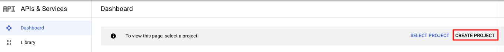
* 생성한 프로젝트 선택하고
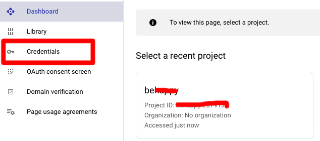
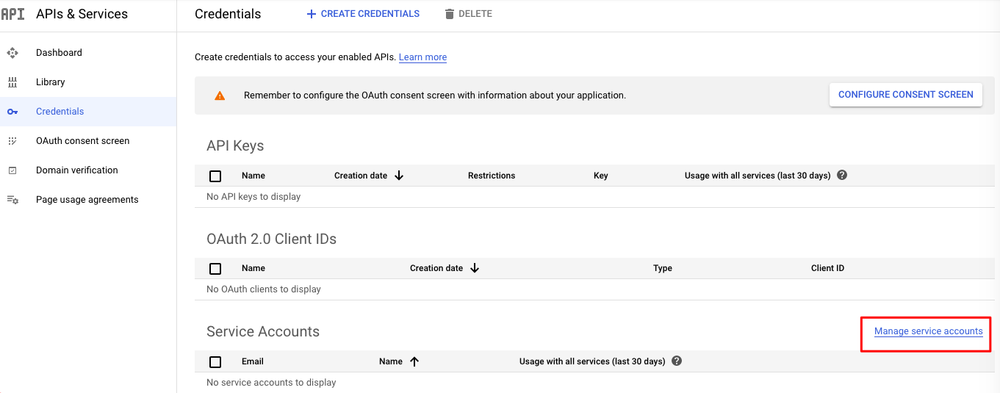
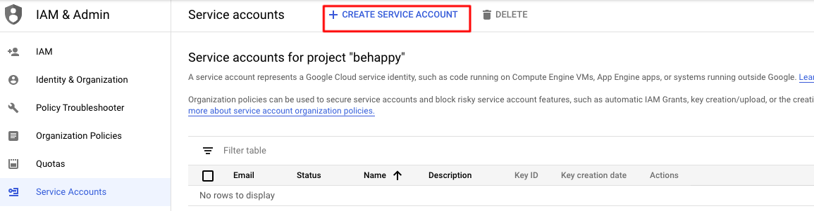
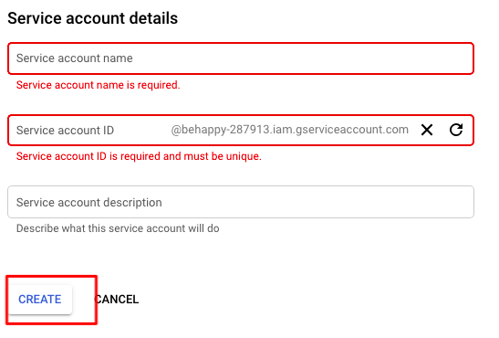
* 다 하고 나면 key를 생성하고 다운 (json file일 떨어짐)
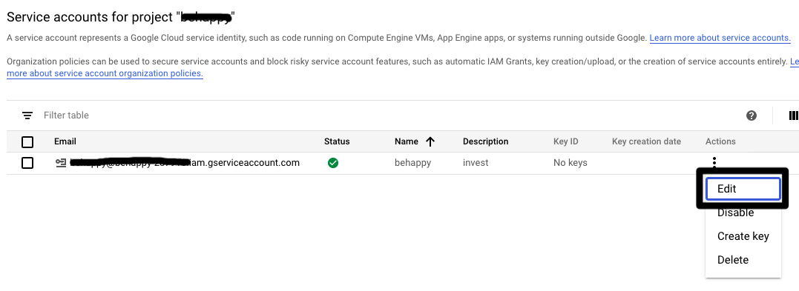
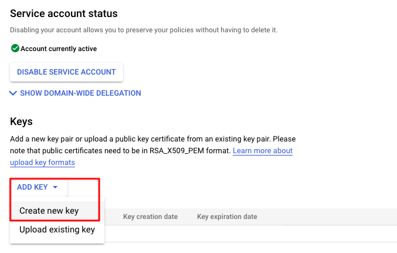
* json file일 떨어짐
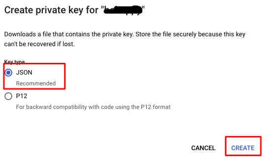
* 인증 json 내 email 을 사용할 스프레드시트의 공유 이메일에 추가
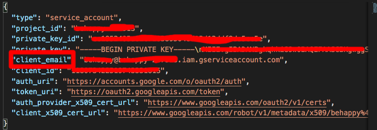
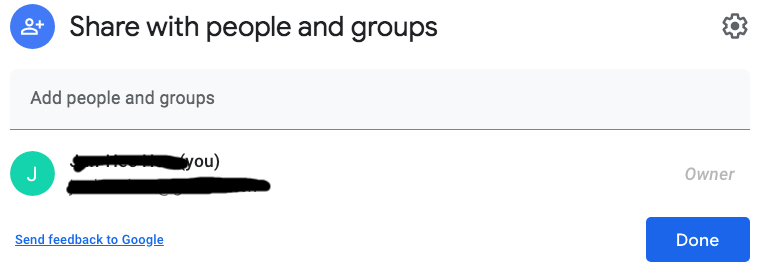
## Code
### 초기 셋팅
* import 하고..
~~~
import gspread
from oauth2client.service_account import ServiceAccountCredentials
~~~
* scope 정의해 주고
~~~
scope = ['https://spreadsheets.google.com/feeds',
         'https://www.googleapis.com/auth/drive']
~~~
* 인증 넣어주고
~~~
credentials = ServiceAccountCredentials.from_json_keyfile_name('./data/다운받은인증파일.json', scope)
gs = gspread.authorize(credentials)
~~~
* url로 연결
~~~
doc = gs.open_by_url('https://docs.google.com/spreadsheets/d/xxxxxxxx/edit#gid=0')
~~~
* 에러가 나면 아래 링크 클릭해서 인증 함 해줘야함.
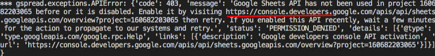
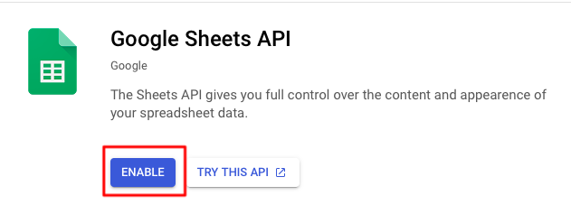

### 읽어오기
* worksheet 불러오기
~~~
worksheet = doc.worksheet('test')
~~~
* Cell 하나 읽어오기
~~~
cell_data = worksheet.acell('B2').value
~~~
* Row, Column, 범위 읽어오기
~~~
row_data = worksheet.row_values(2) # 2번째 Row
column_data = worksheet.col_values(1) # 1번째 Column
range_list = worksheet.range('A1:D3') # 범위
for cell in range_list:
    print(cell.value)
~~~

### 쓰기
* worksheet 불러오기
~~~
worksheet = doc.worksheet('test')
~~~
* Cell 단위 update
~~~
worksheet.update_acell('B1', 'b1 updated')
~~~
* 행 추가
~~~
worksheet.append_row(['new1', 'new2', 'new3', 'new4']) # 위 행에 맞춰서 row를 하나 추가
worksheet.insert_row(['new5', 'new6', 'new7', 'new8'], 5) # 특정 행에 처음부터 row를 추가
~~~
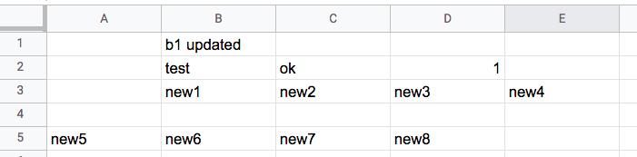
* 워크시트 추가
~~~
worksheet_0 = doc.add_worksheet(title='시트1', rows='500', cols='500')
~~~
* 전체 코드
~~~
# -*- coding: utf-8 -*-
import gspread
from oauth2client.service_account import ServiceAccountCredentials
import pdb

scope = ['https://spreadsheets.google.com/feeds',
         'https://www.googleapis.com/auth/drive']

# scope = ['https://www.googleapis.com/auth/drive']

credentials = ServiceAccountCredentials.from_json_keyfile_name('./data/behappy-287913-cc1952405a61.json', scope)

gs = gspread.authorize(credentials) #.open("Google Sheet Name")

doc = gs.open_by_url('https://docs.google.com/spreadsheets/d/1b4oZS7a7EzlXvYi2Xb8BJtJbboEIuteRs_wrM1yqdtg/edit#gid=0')

worksheet = doc.worksheet('test')
cell_data = worksheet.acell('B2').value
row_data = worksheet.row_values(2)

worksheet.update_acell('B1', 'b1 updated')

worksheet_0 = doc.add_worksheet(title='test2', rows='500', cols='500')
~~~

### 새로운 스프레드시트 생성
* 생성하고 나서 권한 문제로 share를 해 주면 잘 보임.
~~~
import gspread
from oauth2client.service_account import ServiceAccountCredentials

scope = ['https://spreadsheets.google.com/feeds',
         'https://www.googleapis.com/auth/drive']

credentials = ServiceAccountCredentials.from_json_keyfile_name('./data/behappy-287913-cc1952405a61.json', scope)

gtest = gs.create('새로운 테스트')
# 권한이 없기 때문에 share를 해 줘야 함.
gtest.share('junhee.heu@gmail.com', perm_type='user', role='owner')
~~~
* 처음엔 문제가 발생해서... google drive 접근에 대한 허가를 해줘야 함. (아래 링크에서 enable)
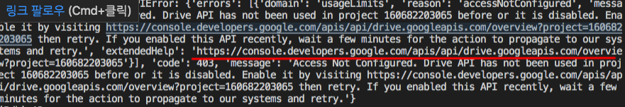

## 환경 설정
* google api 관련 lib. 설치 필요
~~~
pip install gspread
pip install --upgrade oauth2client

pip install --upgrade google-api-python-client google-auth-httplib2 google-auth-oauthlib
~~~

<!--
그림 추가

*single asterisks* - 기울임체
_single underscores_ - 기울임체
**double asterisks** - 굵은글씨체
__double underscores__ - 기울임체/굵은글씨체
***triple underscores*** - 기울임체/굵은글씨체
~~cancelline~~ - 취소줄

기본 테이블
| 이름   | 설명  | 나이 |
| ----- | ---- | --- |
| 김태완  | 아빠  | 40 |
| 임선영  | 엄마  | 30 |
| 김민수  | 아들  | 2  |

테이블 정렬
오른쪽 정렬
—-:
왼쪽 정렬
:—-
가운데 정렬
:—-:

| 이름   | 설명  | 나이 |
| :----- | ----: | :---: |
| 김태완  | 아빠  | 40 |
| 임선영  | 엄마  | 30 |
| 김민수  | 아들  | 2  |

링크
[taewan.kim](http://taewan.kim)

참조 링크
[구글][1]
[1]: http://www.google.com

각주
최근 스칼라는 매우 인기가 높은 언어이다.[^scala]
\[^scala]: 스칼라는 마틴 오더시크가 개발한 함수형 언어이다.
-->